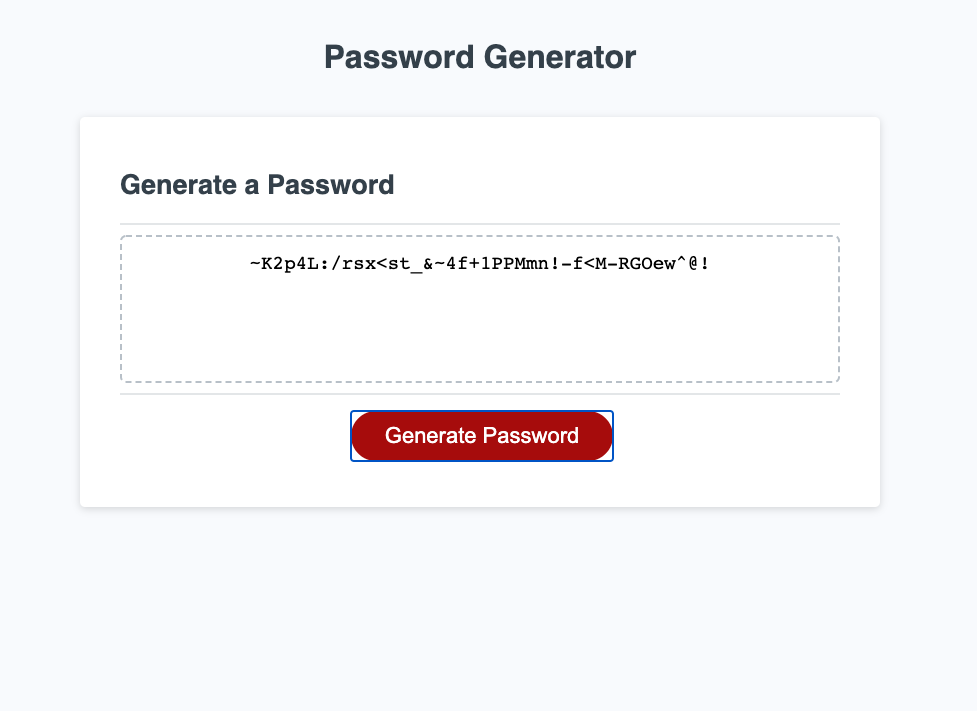

PasswordGenerator
password generator project

Author: Tomasz Siemion
Project: Password Generator
LINK: https://rotosti.github.io/H3-PasswordGenerator/

The goal of the program is to generate a random password for the user.  The user will follow a series of dialog boxes using alert(), confirm(), and prompt().  Once the user completes the input portion a random password will be generated with the user's specifications.  The user must enter a value from 8-128 to select the amount of characters in the password.  The user will then choose if they want lower case letters, upper case letters, numbers, or special characters.  Once the user input is gathered, the password will be displayed onto the webpage in the specified text area.

HTML / CSS
The project was provided with HTML and CSS.

Javascript
The project was provided with an event listener for the Generate Password button. The event listener listens for a click event on the button and calls the writePassword() function. In the writePassword() function, the function makes a call to generatePassword() which is where the password is created.

Initially I use a variable to store a boolean of if the user wants to continue generating the password. Then the function uses prompt() to collect a number between 8-128 characters from the user.  Once the user provides the data, it is parsed into an integer.  After being parsed, the value provided by the user is verified to make sure the function was provided a number within the range of 8-128.  If the value is not a number, is less than 8 characters, or greater than 128 characters, the function enters a while loop.  The reason why the while loop was used was to continuously scold the user for not providing the correct input, ask if the user wants to continue generating a password, or to reenter the information again.  It will continuously do the 3 steps until the user decides to terminate the process or provide the correct value.

If the user decides to terminate the process, the text area on the web page will be updated with that information. If the user decides to continue with the process, the function will move on to the character type selection process.  The user will decide if they want lower case letters, upper case letters, numbers, and/or special characters.  The selections will be stored in variables as booleans.  The requirement is that there must be at least once character type selected in order to continue.  If the user declines to pick a character type, the function will go into another while loop which will scold the user, ask if the user wants to continue with the process, and go through the selection process again.  If the user wants to terminate the password generation process at that point, they will be able to.  If the user decides to continue, they will be given the opportunity to make selections.  The process will repeat until the the user quits or selects at least once character type.

Once the user provides valid information and wants to continue, the function will move on to start generating the password.  The function will build a character bank of user selected characters (upper case letters, lower case letters, numbers, and/or special characters.)  Once the bank is created, it will move on to start building the password.  The password generation process uses Math.random() coupled with Math.floor() to generate an index.  The index is used to access the character bank a pull a character out by random and will repeat this process until the user specified password length is achieved. 

Once the password is generated, it goes through a quality control process using RegEx.  It will verify if at least one character of each user selected character type exists in the randomly generated password.  If a selected character type is missing, the password will be erased and remade following the same process as above.  This process will repeat until verification has guaranteed the password meets the user selected criteria.  Once quality control is passed, the function will release from the password generation while loop and return the generated back to the function caller.  This will in turn take the password and display it in the text area on the web page and the process is complete.

